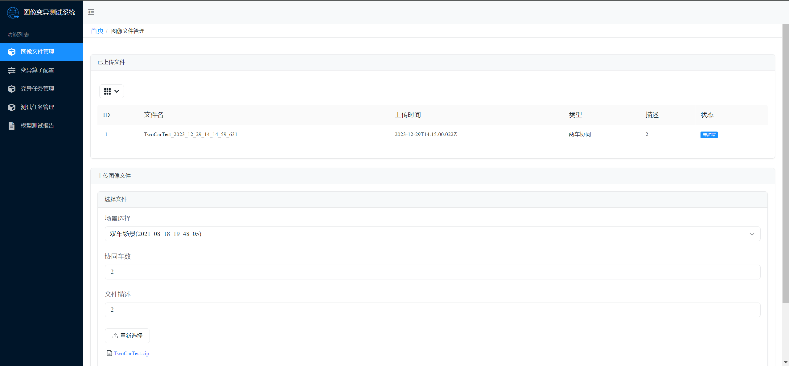

# 基于图像变异的协同感知模型测试系统 V2X-ImageMutate-Test-System

## 总览

本项目设计并实现了一种基于图像变异的车联网协同感知测试系统，分别实现了感知场景管理模块、变异算子配置模块、变异任务管理模块、测试任务管理模块、测试报告生成模块。经过系统测试和实验评估后，系统满足用户的需求，且能有效测试出协同感知模型中的缺陷。

为了更加有效的测试协同感知模型在外界干扰条件下的感知性能，本系统还设计了模拟极端天气（雾天、降雨、降雪）、高温、外界光线变化和车辆抖动场景的六种图像变异算子。利用这些算子生成在外界干扰条件下的测试数据。

考虑到多车场景下协同感知模型的特点，本系统为其制定了三个评估指标来量化模型的感知性能。

### 架构

下图展示了本系统的总体结构：
前端交互层

- 为用户提供可视化操作界面
- Vue框架 + ECharts组件实现
业务逻辑层
- 模块划分：感知场景管理模块、变异算子配置模块、变异任务管理模块、测试任务管理模块、测试报告生成模块
- Django框架 + Nginx实现
算法能力层
- **测试目标**：CoBEVT网络，输入车载摄像机的拍摄图像，输出行驶区域的语义分割鸟瞰图
- 图像处理：open-cv、PIL、Matplotlib
数据持久化层
- Mysql数据库：存储图像文件信息、变异配置信息，变异任务信息、测试任务信息以及测试结果数据


### 流程

#### 变异算子配置流程


#### 变异任务管理流程


#### 测试任务管理流程


#### 测试报告生成流程


### 详细设计


AugStraregy

- 使用策略模式，有利于变异算子扩展
- 雾天、降雨、降雪、阴影、高温、运动模糊变异算子的业务逻辑参考 RandAugment 中的部分实现思路
- 每一个变异算子均设置了弱、中、强3个变异强度来丰富生成的测试数据

AugTaskExecutor

- 独立的任务执行服务，在子线程中执行图像数据变异任务
- 调用AugStraregy中的变异算子对图像文件进行变异操作


ModelTester

- 加载车联网协同感知模型并对测试数据进行推理
- 将推理结果进行合并得到语义分割鸟瞰图

TestTaskExecutor

- 独立的任务执行服务，在子线程中执行模型测试任务

### 评估指标设计


## 使用方法

### 构建 & 运行

```shell
git clone https://github.com/ysyyhhh/V2X-ImageMutate-Test-System.git

cd V2X-ImageMutate-Test-System

# 构建镜像
docker-compose build

# 运行
docker-compose up -d
```

### 测试操作

1.图像文件管理>
        填写下面字段后,点击提交

- 场景选择： 双车场景
- 协同车数：2
- 文件描述：{任意文字描述}
        - 文件上传：TwoCarTest.zip


2.变异算子配置>
  填写下面字段后,点击提交

- 变异算子配置:{任意配置}
- 图像文件配置:
  - 两车协同
    - 文件选择:id=1
            - 中心车辆选择: {任意车辆}
            - 是否对单车分别扩展: 是
- 扩展任务名称: {任意名称}


3.变异任务管理>

 1. 点击 "执行任务"
 2. 等待状态变成已完成(大致1~3s)
 3. 变异结果查看中选择结果,得到图像数据集


4.测试任务管理>
 1.此时出现了刚刚的扩展任务, 点击 "执行任务"
 2.等待大概10s后,状态变成已完成


5.模型测试报告>

 选择测试报告,获得 "可视化展示" 和 "图表展示"


### 演示视频

[演示视频](demo.mp4)
