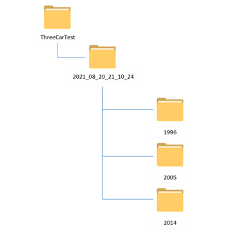

## 总体要求：自行搭建变异测试或模糊测试工具

- 项目Demo：Github、Gitee
- 项目源代码：Java、C、Python、Shell...

- 开发日志：Markdown文件，devlog.md
  - 开发过程中的进度安排、任务分配、碰到的难题和解决的过程等。

- 项目文档：Markdown文件，README.md
  - 项目的设计方案（架构、流程、类层次）和使用方法
  - 注意描述的逻辑性，善用“总-分”结构

AI-1：面向xxx场景的深度学习模型测试技术
• 背景
  • 问题场景的领域特性影响智能模型测试方法的设计
  • 场景：图像、点云、人脸识别、语音识别
• 任务构成
  • 提供待测模型和场景数据集，分析特定场景、建立测试需求、设计并实现可用测试技术

## 实现

场景数据集 OPV2V

上传的压缩包文件夹需要满足如下图中格式，其中2021_08_20_21_10_24代表数据场景，1996、2005、2014分别代表3辆车，其中存放的是该车4个视角的拍摄图像以及语义分割鸟瞰图ground truth和其他配置信息。

